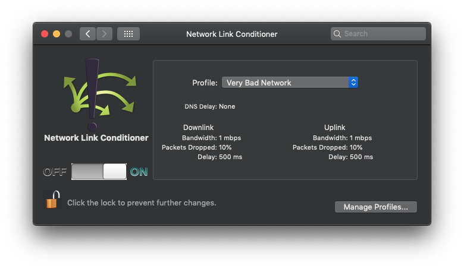

# BabylonDemo

**Spec**
https://github.com/Babylonpartners/iOS-Interview-Demo/blob/master/demo.md

**Note**

To record the demo, the **NetworkLinkConditioner** has been used (to slow down the network calls), with the following profile:

## Dependencies

Depedencies are managed through **Carthage**.

Please run `carthage update --platform ios` to synchronise them.

## Third Party Frameworks

- `RxSwift`
- `MBProgressHUD`
- `Quick` + `Nimble`

## Architecture

### MVVM-C

**BabylonDemo** (app) -> links to -> **Core.framework** (which contains 99% of the app)

`AppCoordinator` starts the `PostsCoordinator` on the key window.

`PostsCoordinator` embeds a `PostsViewController` inside a `UINavigationController`,
and makes it the root view controller of the key window.

`PostsViewModel` fetches the posts, that are then shown in the table view.

Once a post is tapped, `PostsTableViewCellViewModel` notifies `PostsViewModel` via delegation.
`PostsViewModel` then notifies `PostsCoordinator`, again through delegation.

`PostsCoordinator` then starts `PostDetailCoordinator` on the navigation controller.
It pushes a `PostDetailViewController` on the navigation stack.

`PostDetailViewModel` fetches the users and the comments.

### Caching

`CachedWebService` is a decorator for any class that implements `WebserviceType` protocol.
It provides basic storage capabilities.

For the sake of the demo, `NSUserDefaults` is being used as storage.

## Tests

**CoreTests** are tests written for **Core.framework**.

They have been written for the view models and the view controllers.
